# Roteiro 1 - Computação em Nuvem
Membros: Ian Faray e Vitor Tanaka

## Objetivo
Este roteiro tem como objetivo demonstrar o processo de criação de uma infraestrutura de Nuvem Bare-metal, em que introduziram-se conceitos básicos sobre gerenciamento de hardware e rede de computadores. Utilizamos um ambiente composto por cinco máquinas, onde implementamos:

- Um servidor PostgreSQL para gerenciamento de banco de dados.

- Duas instâncias de uma aplicação Django, distribuídas em servidores distintos.

- Um servidor Nginx configurado como balanceador de carga, distribuindo as requisições entre as aplicações Django.

## Montagem do Roteiro

### Infraestrutura
Inicialmente, criamos a infraestrutura de Nuvem Bare-metal:

- Instalamos o Ubuntu Server 22.04 LTS na NUC principal, sendo nossa main, utilizando um pendrive bootável.

- Configuramos o MAAS para gerenciar as máquinas, sendo acessado via autenticação SSH.

- Adicionamos as 5 máquinas disponíveis (server1 a server5) ao MAAS, configurando-as para inicialização via PXE.

- Criamos uma OVS Bridge para conectar as interfaces de rede, garantindo a comunicação entre as máquinas.

- Realizamos um NAT para permitir o acesso externo a partir da rede Insper, conectando ao server main pela porta 22.

### Aplicação
Primeiramente, realizamos o deploy do Ubuntu no server1 pelo MAAS, em que, em seguida, instalamos o PostgreSQL.
### Tarefa 1
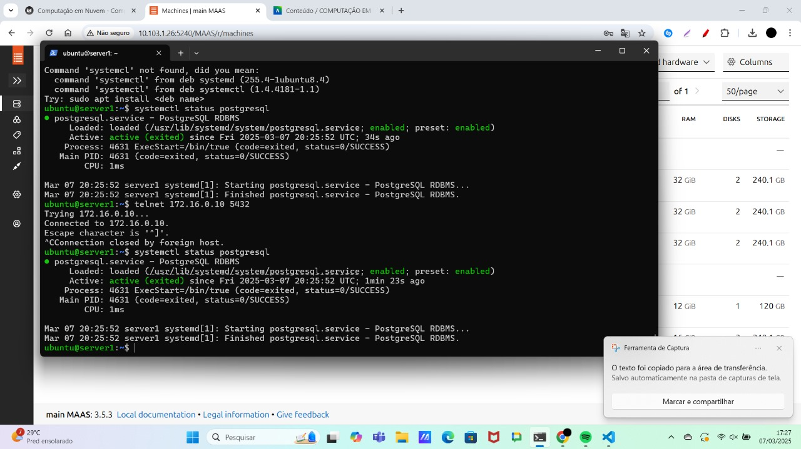
*Tarefa 1.1 Print Funcionando e seu Status está como "Ativo" para o Sistema Operacional.*  

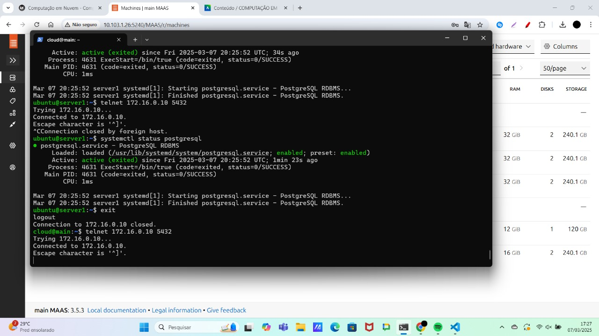
*Tarefa 1.2 Acessivel na própria maquina na qual ele foi implantado.* 
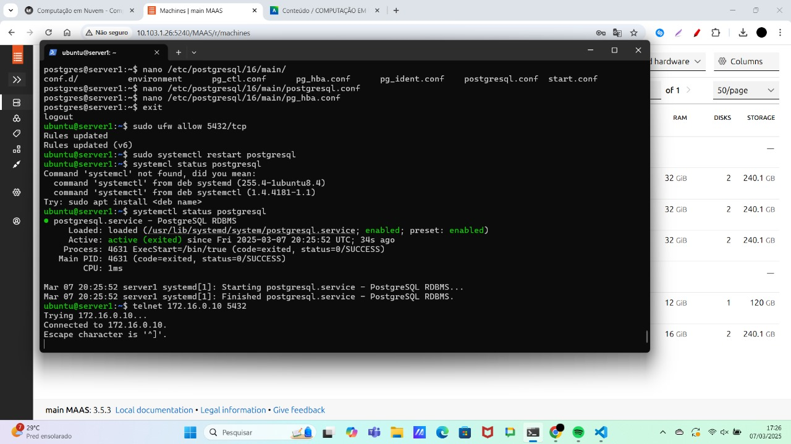
*Tarefa 1.3 Acessivel a partir de uma conexão vinda da máquina MAIN*

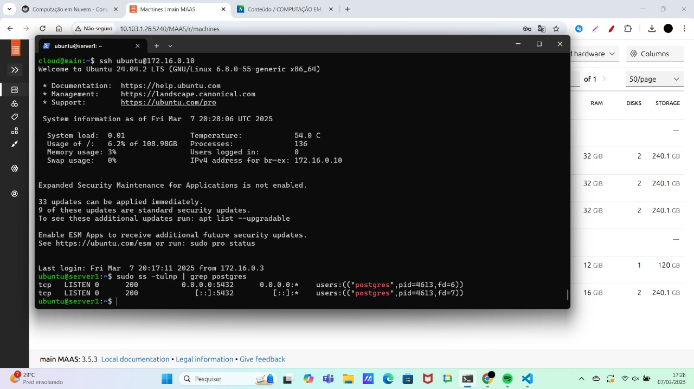
*Tarefa 1.4 Em qual porta este serviço está funcionando*

### Parte II: Aplicação Django
No segundo servidor, assim como no primeiro, realizamos o deploy do Ubuntu, porém neste caso instalamos uma aplicação Django já desenvolvida.   
### Tarefa 2

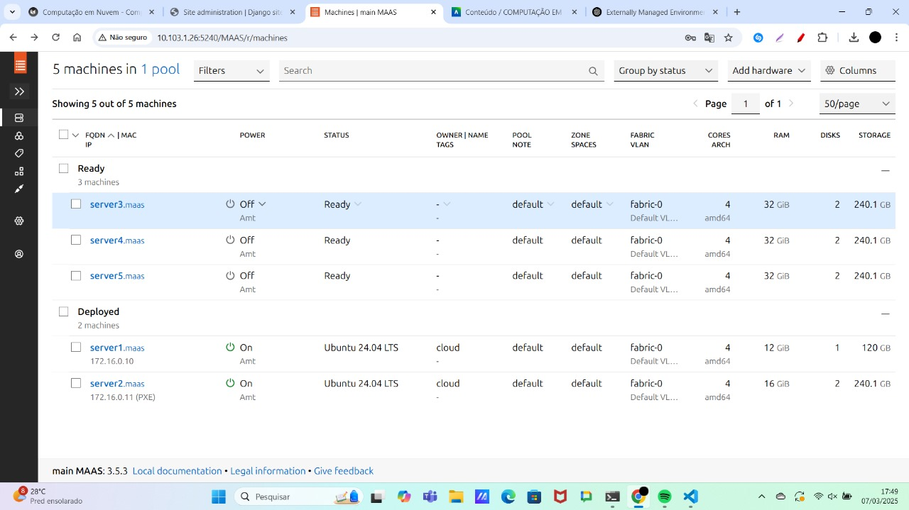
*Tarefa 2.1 Dashboard do MAAS com as máquinas*

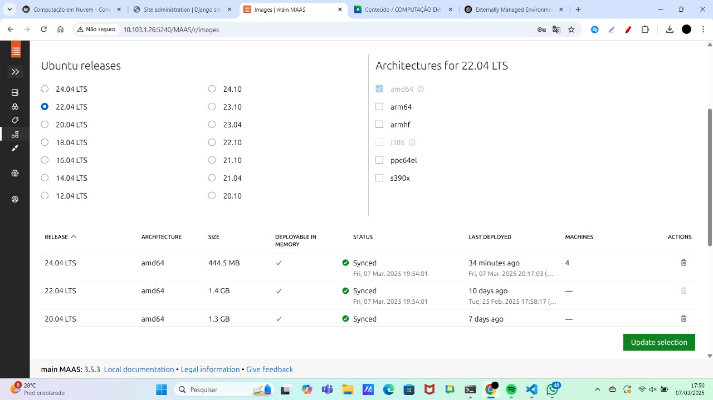
*Tarefa 2.2 aba images, com as imagens sincronizadas.*

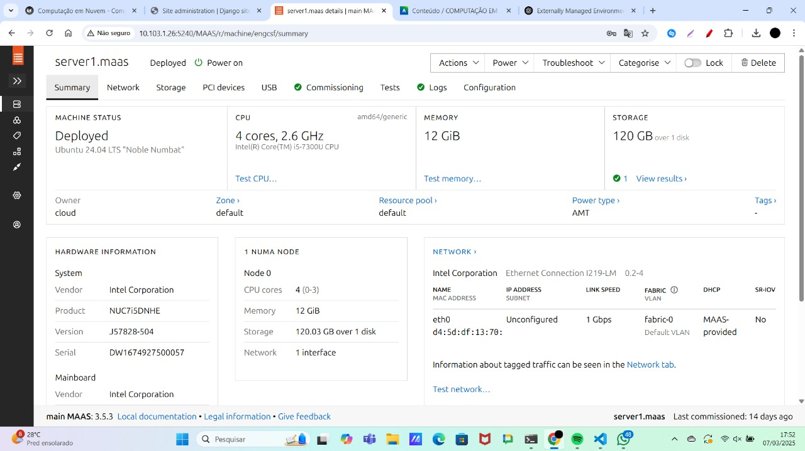
*Tarefa 2.3-1*

*Tarefa 2.3-2*

*Tarefa 2.3-3*

*Tarefa 2.3-4*

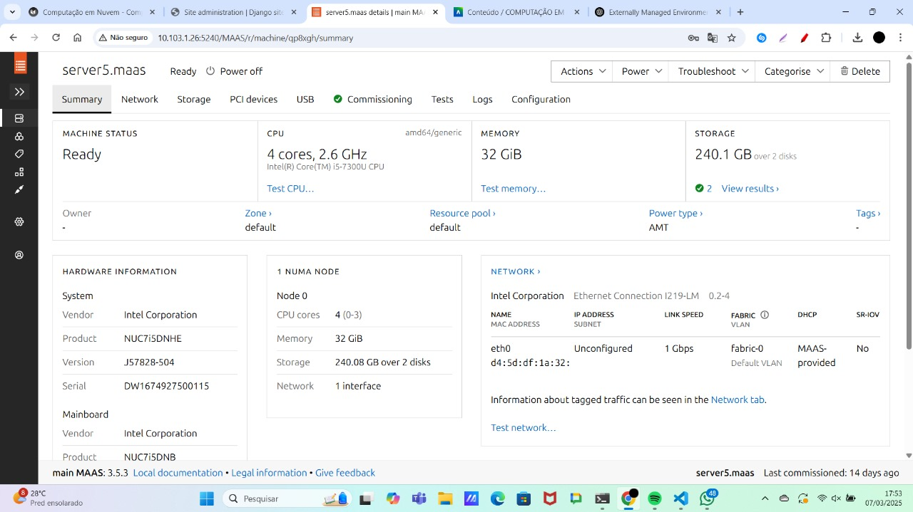
*Tarefa 2.3-5 Da Aba de cada maquina(5x) mostrando os testes de hardware e commissioning com Status "OK*

### Utilizando o Ansible - deploy automatizado de aplicação
### Tarefa 3

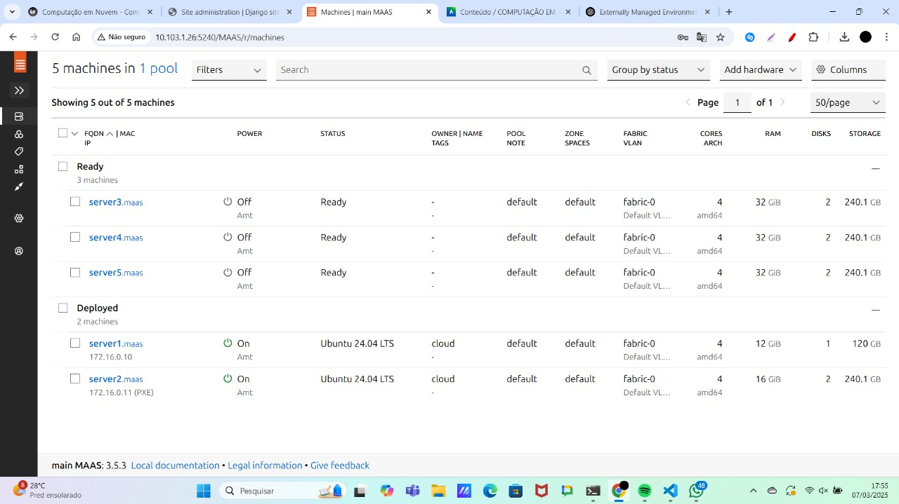
*Tarefa 3.1  print da tela do Dashboard do MAAS com as 2 Maquinas e seus respectivos IPs.*

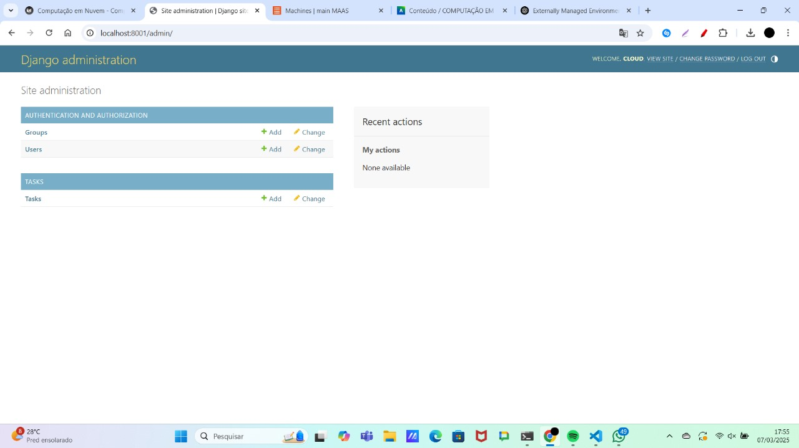
*Tarefa 3.2 print da aplicacao Django, provando que voce está conectado ao server*

tarefa 3.3: 
A implementação manual da aplicação Django e do banco de dados foi realizada com um script (install.sh) que automatiza a instalação de dependências, a migração do banco de dados e a criação de um superusuário. O ambiente foi configurado instalando pacotes essenciais (python3-dev, libpq-dev, python3-pip) e instalando as bibliotecas necessárias via pip. Em seguida, aplicamos as migrações do banco de dados com python3 manage.py migrate. Para garantir a inicialização automática, adicionamos um comando ao crontab que executa o script de inicialização (run.sh) no reboot. O superusuário foi criado definindo variáveis de ambiente e executando python3 manage.py createsuperuser --noinput. A aplicação roda na porta 8080. Para permitir acesso externo, configuramos um túnel SSH redirecionando a porta 8080 do servidor remoto para a porta 8001 local.

### Ansible
Utilizamos o Ansible para fazermos deploy da aplicação Django. No nosso caso, escolhemos o server 4.
### Tarefa 4
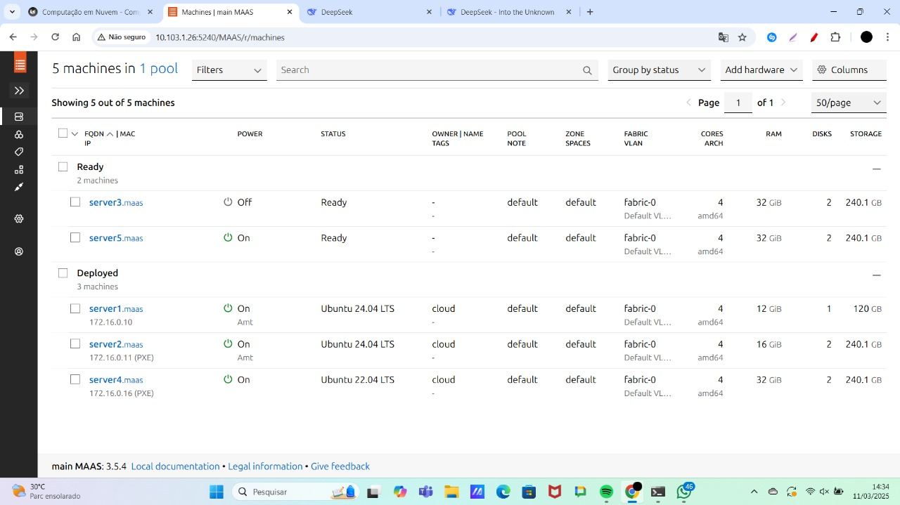
*Tarefa 4.1 print da tela do Dashboard do MAAS com as 3 Maquinas e seus respectivos IPs.*

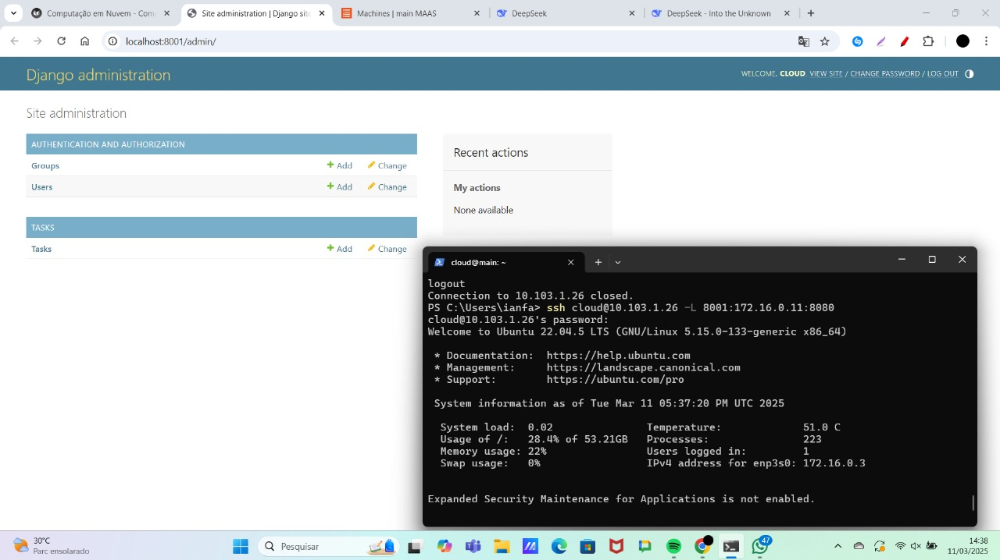
*Tarefa 4.2 print da aplicacao Django, provando que voce está conectado ao server2 *

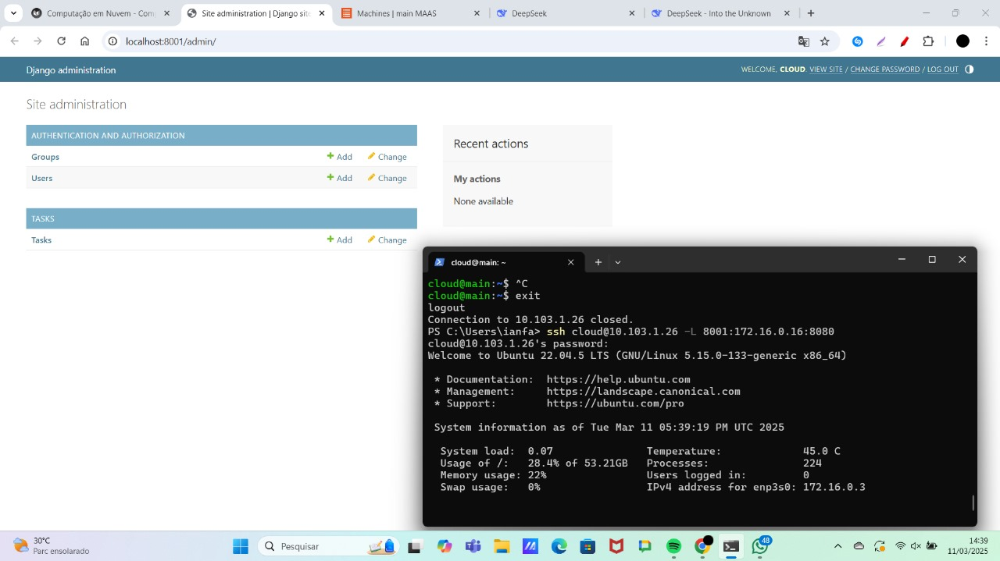
*Tarefa 4.3 print da aplicacao Django, provando que voce está conectado ao server3(4) no nosso caso*

Tarefa 4.4:A instalação manual de uma aplicação Django é demorada, propensa a erros e difícil de replicar, exigindo a execução manual de comandos em cada servidor, sem garantia de idempotência. Já com o Ansible, todo o processo é automatizado através de playbooks, garantindo eficiência, repetibilidade e consistência entre servidores. O Ansible permite gerenciar múltiplos servidores simultaneamente, evitar erros manuais e documentar todo o processo. o playbook tasks-install-playbook.yaml foi utilizado para instalar Django no server4, garantindo a instalação de dependências, a configuração do banco de dados, a criação do superusuário e a configuração da inicialização automática

### Tarefa 5
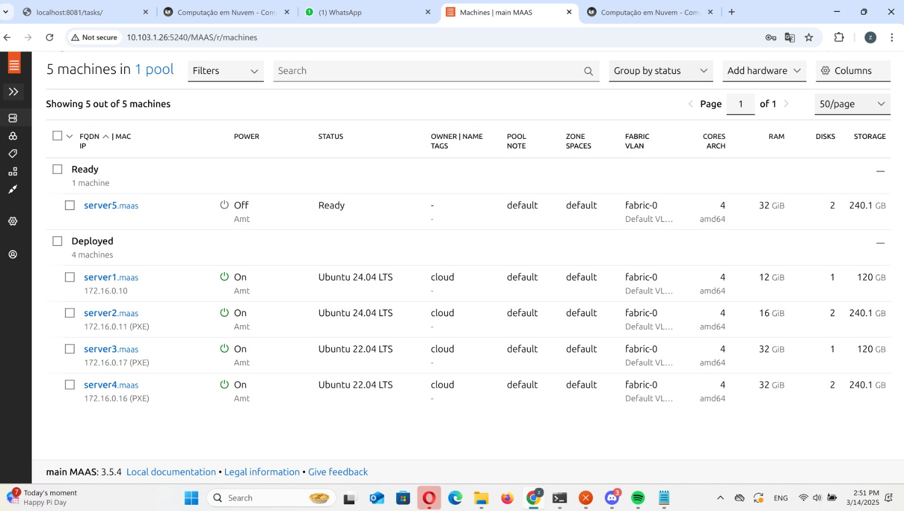
*Tarefa 5.1 print da tela do Dashboard do MAAS com as 4 Maquinas e seus respectivos IPs.*

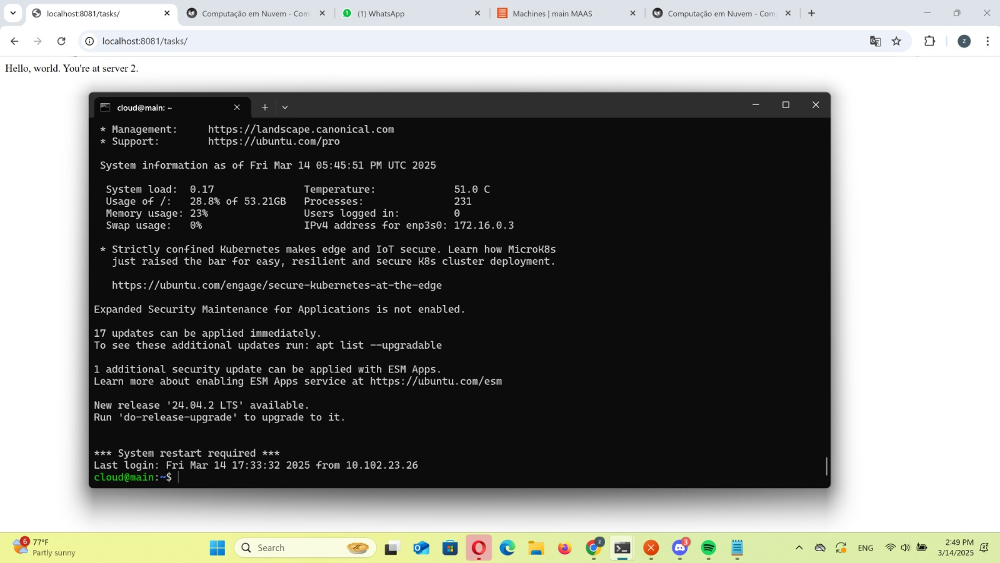
*Tarefa 5.2-1*

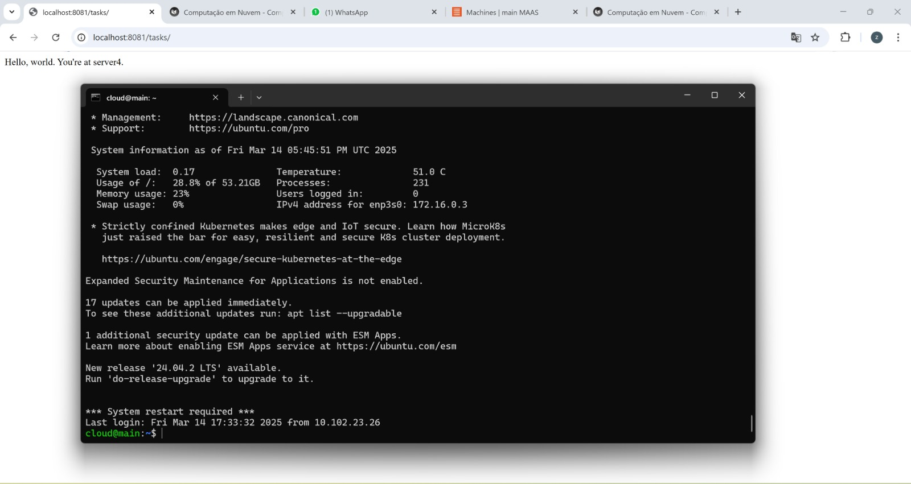
*Tarefa 5.2-2prints das respostas de cada request, provando que voce está conectado ao server 4, que é o Proxy Reverso e que ele bate cada vez em um server diferente server2 e server3 (no nosso caso, server4).*

## Discussões

Apesar da prática ter sido um sucesso, encontramos diversos obstáculos e dificuldades no processo até atingirmos o resultado final. O primeiro contato com o MAAS e a configuração da infraestrutura foi desafiador, sendo necessário pesquisar e consultar os professores e assistentes, que nos orientaram e auxiliaram para superar as dificuldades. Além disso, imprevistos ocorreram, até inesperados pelos professores, como por exemplo, as imagens do Ubuntu que instalamos no MAAS sofreram uma atualização e ficaram incompatíveis com o firmware das máquinas, o que nos obrigou a voltar alguns passos para continuar o roteiro. Apesar disso, esses incidentes são importantes para aprendermos a lidar com problemas reais e a buscar soluções em grupo, o que contribui para o nosso desenvolvimento profissional e conhecimento técnico.

## Conclusão
A realização deste roteiro permitiu consolidar conhecimentos sobre redes, sub-redes e gerenciamento de infraestrutura em nuvem. Além disso, exploramos ferramentas como MAAS, Ansible e Nginx, que facilitam a implementação e o gerenciamento de aplicações distribuídas. O balanceamento de carga e a alta disponibilidade foram alcançados com sucesso, demonstrando a eficácia da infraestrutura criada.
