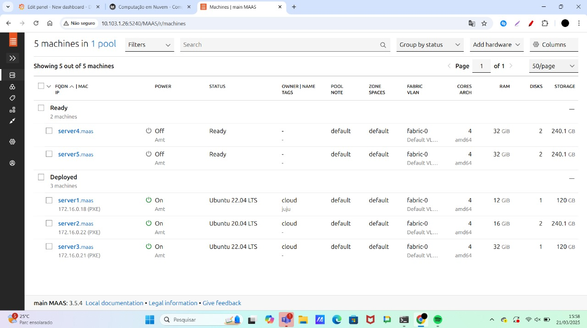
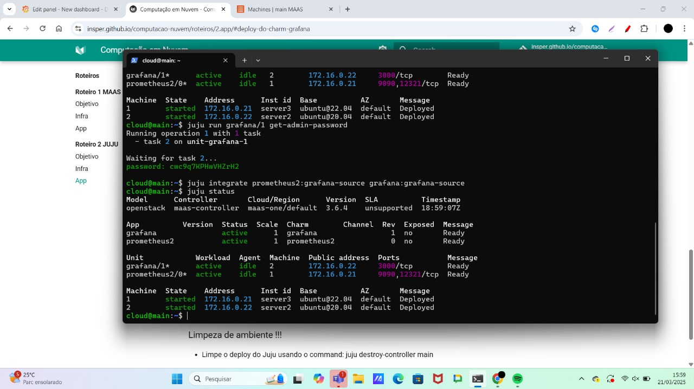
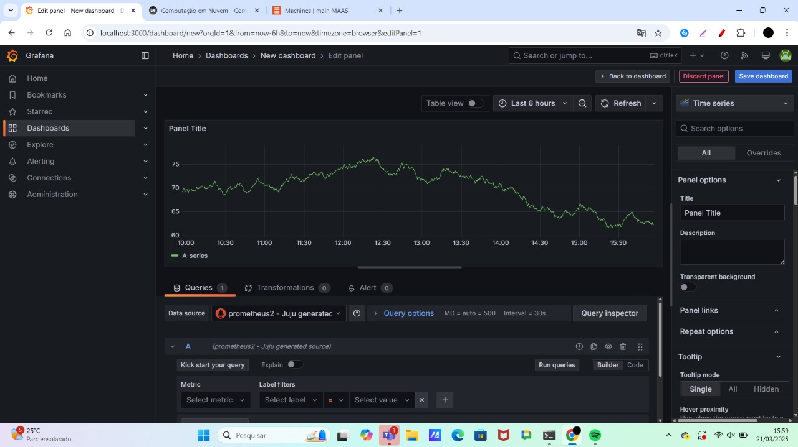
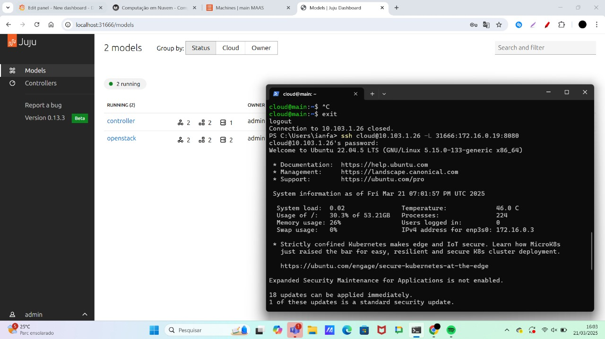
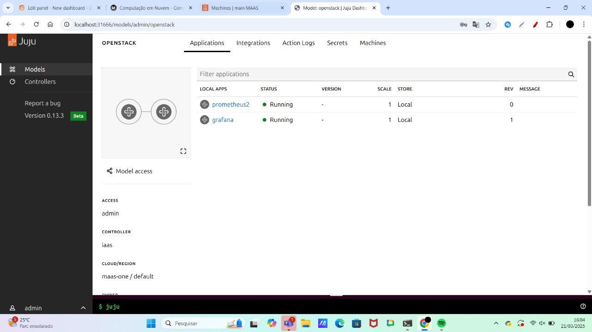

# Roteiro 2: Utilizando a Infraestrutura Bare Metal com o Juju

## Introdução
Neste roteiro, utilizamos o Juju para criar uma infraestrutura bare metal integrada ao MAAS
## Configuração do Ambiente

### Instalação do Juju
- Instalamos o Juju na máquina main.  
- Verificamos se o MAAS estava disponível como provedor de recursos no Juju.

### Integração com o MAAS
- Criamos um arquivo de configuração (maas-cloud.yaml) para adicionar o cluster MAAS ao Juju.  
- Adicionamos as credenciais do MAAS para que o Juju pudesse interagir com a cloud criada.

### Criação do Controlador
- Criamos o controlador Juju no servidor server1 utilizando a tag juju.  
- O controlador foi configurado para gerenciar toda a infraestrutura.

## Deploy das Aplicações

### Instalação do Dashboard do Juju
- Instalamos o Dashboard do Juju 

### Deploy do Grafana e Prometheus
- Realizamos o deploy local dos charms do Grafana e Prometheus utilizando o Juju.  
### Integração entre Grafana e Prometheus
- Integramos o Grafana com o Prometheus.  

# Atividades

*print da tela do Dashboard do MAAS com as Maquinas e seus respectivos IPs*  

*print de tela do comando "juju status" depois que o Grafana estiver "active"*

*print da tela do Dashboard do Grafana com o Prometheus aparecendo como source*

*(print) que você está conseguindo acessar o Dashboard a partir da rede do Insper*

*print na tela que mostra as aplicações sendo gerenciadas pelo JUJU*