# Roteiro 3: Private cloud com Openstack e Juju

## Introdução
Este roteiro tem como objetivo a implementação de um ambiente de nuvem privada, entendendo os conceitos básicos e aplicando na prática com o uso do OpenStack e do Juju. O OpenStack é uma plataforma de computação em nuvem de código aberto que permite a criação e gerenciamento de infraestrutura como serviço (IaaS). O Juju, já utilizado anteriormente, é uma ferramenta de orquestração que facilita o gerenciamento de serviços e aplicações em ambientes distribuídos.
## Configuração do Ambiente - Infra

### Implantação do OpenStack
 - Primeiramente, no MAAS, adicionamos as seguintes tags às máquinas:
    - controller - node1
    - reserva - node2 (será usado posteriormente)
    - compute - node3, node4 e node5

 - Com isso, verificamos no MAAS se o br-ex estava configurado corretamente em todos os nós, para assim, o OpenStack conseguir se comunicar com a rede externa.

 - Após as configurações iniciais, implementamos o deploy do juju controller no node1, para fazermos as instalações necessárias em todos os nós.

 - Por fim, com os comandos juju deploy e juju integrate e com arquivos de configuração .yaml, instalamos todos os programas requisitados no roteiro, sempre verificando pelo juju status as máquinas e instalações.
    - Ceph OSD
    - Nova Compute
    - MySQL InnoDB Cluster
    - Vault
    - Neutron Networking
    - Keystone
    - RabbitMQ
    - Nova Cloud Controller
    - Placement
    - Horizon - OpenStack Dashboard
    - Glance
    - Ceph Monitor
    - Cinder
    - Ceph RADOS Gateway
    - Ceph-OSD Integration para as máquinas e aplicações estarem *active*

## Configurando o OpenStack - Setup
 - Próximo passo foi configurar o OpenStack, configurando os serviços que controlam VMs (Nova), os volumes de disco (Cinder) e a estrutura de rede virtual (Neutron). Para isso, a realização foi separada nos seguintes passos: 

### Passo 1 - Autenticação
 - Na main, criamos o arquivo openrc, que contém as credenciais de acesso ao OpenStack.

 ```
  source openrc 
 ```
 ```
 env | grep OS_
 ```
 - Com isso, conseguimos o usuário e senha para acessar o Horizon, o Dashboard do OpenStack.

### Passo 2 - Horizon

 - Com as credenciais prontas, acessamos o Dashboard do Openstack, chamado de Horizon. Para isso, realizamos um NAT no roteador para o Horizon na porta interna 80 e porta externa 8080, acessando a partir do 10.103.1.26:8080/horizon. O Domain name utilizado no acesso foi *admin_domain*.


#### Tarefa 1 
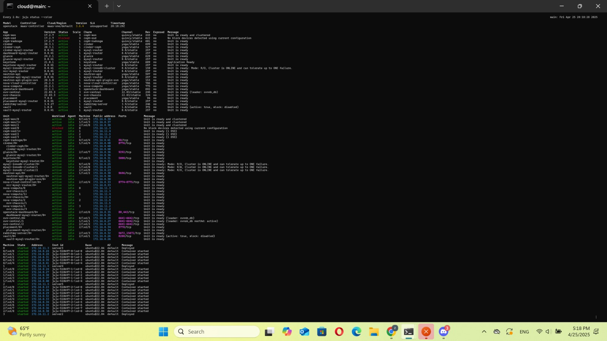
    *1 - Print do status do Juju*  

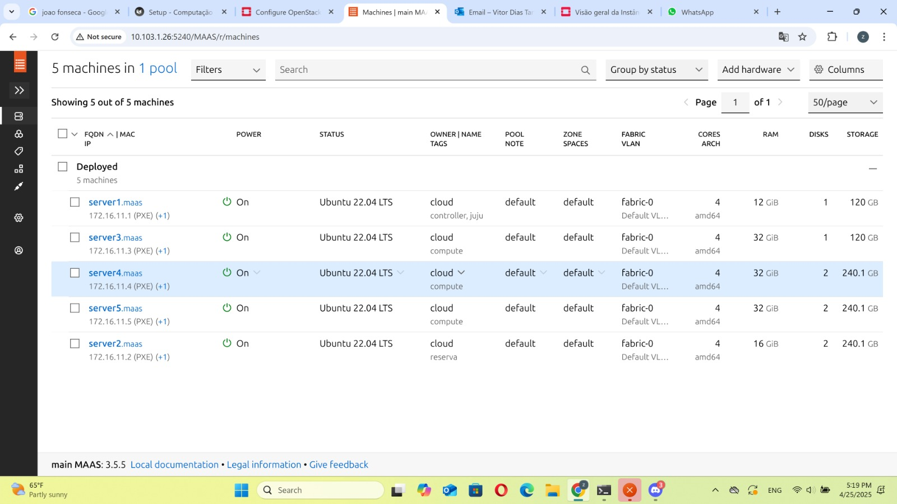
    *2 - Print do Dashboard do MAAS com as máquinas*

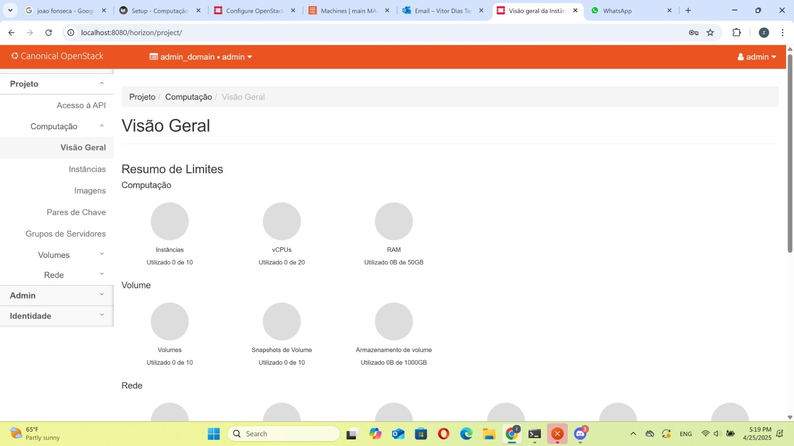
    *3 - Print da aba compute overview no OpenStack Dashboard*

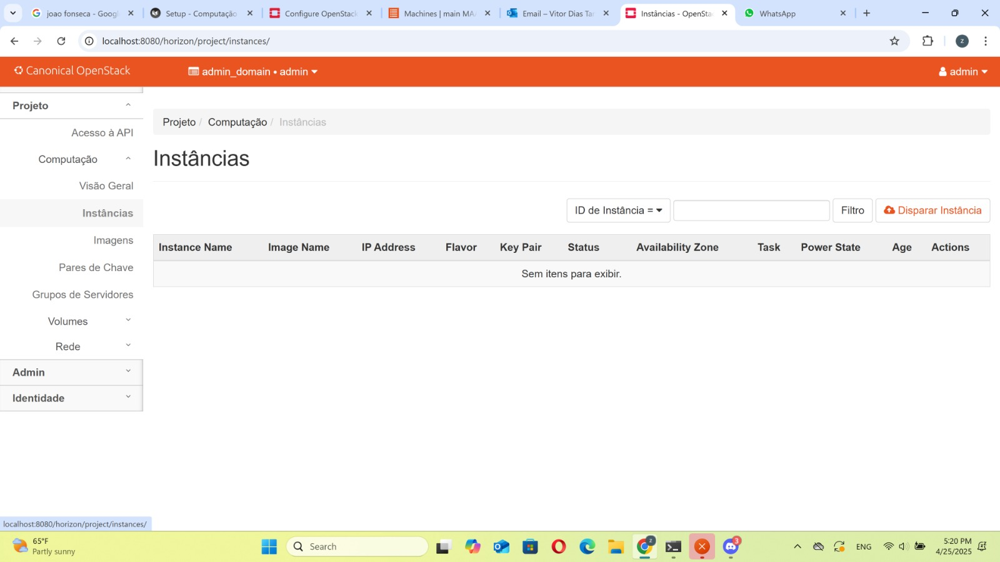
    *4 - Print da aba compute instances no OpenStack Dashboard*

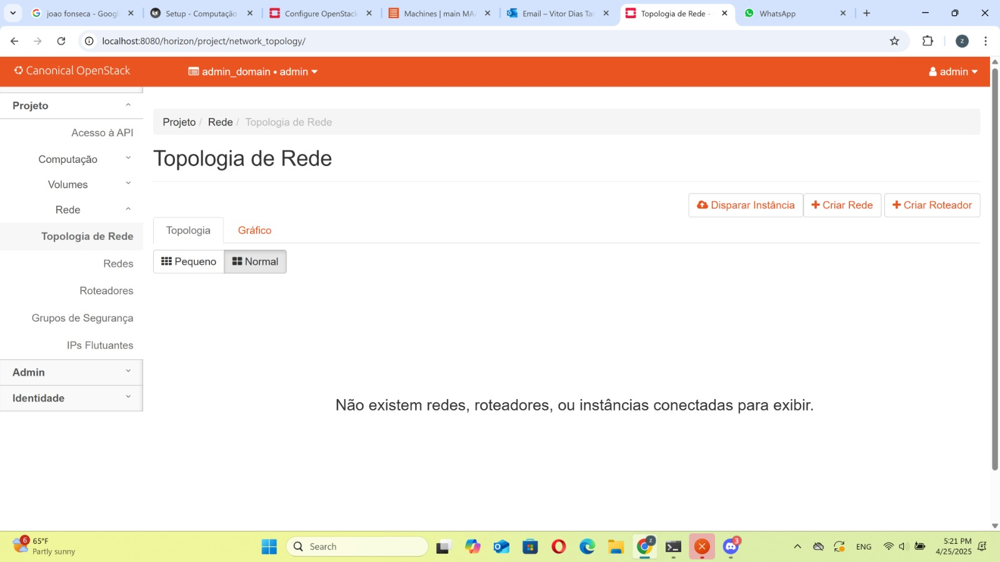
    *5 - Print da aba network topology no Openstack Dashboard*

### Passo 3 - Imagens e Flavors
 - Utilizando a documentação oficial do OpenStack, nessa etapa criamos imagens e flavors para nossa nuvem. Imagem se refere ao sistema operacional a ser bootado nas máquinas virtuais a serem implementadas. Já os flavors determinam os *specs* de hardware da VM, por exemplo: memória RAM, armazenamento, CPU.

 - Para isso, primeiramente instalamos o client do OpenStack na main.
 ```
 sudo snap install openstackclients
 ```
 - Em seguida, carregamos as credenciais, verificamos os serviços disponíveis e fizemos pequenos ajustes na rede.
 ```
 source openrc
 ```
 ```
 openstack service list
 ```
 ```
 juju config neutron-api enable-ml2-dns="true"
 juju config neutron-api-plugin-ovn dns-servers="172.16.0.1"
 ```
 - Logo após, importamos a imagem do *Ubuntu Jammy* e a chamamos de jammy-amd64
 ```
 mkdir ~/cloud-images

 wget http://cloud-images.ubuntu.com/jammy/current/jammy-server-cloudimg-amd64.img \
   -O ~/cloud-images/jammy-amd64.img
 ```
 ```
 openstack image create --public --container-format bare \
   --disk-format qcow2 --file ~/cloud-images/jammy-amd64.img \
   jammy-amd64
 ```
 - Por fim, criamos 4 flavors:
    - ```m1.tiny: 1 vCPUs, 1Gb de RAM, 20Gb de disco```
    ```
    openstack flavor create --ram 1024 --disk 20 --vcpus 1 m1.tiny
    ```
    - ```m1.small: 1 vCPUs, 2Gb de RAM, 20Gb de disco```
    ```
    openstack flavor create --ram 2048 --disk 20 --vcpus 1 m1.small
    ```
    - ```m1.medium: 2 vCPUs, 4Gb de RAM, 20Gb de disco```
    ```
    openstack flavor create --ram 4096 --disk 20 --vcpus 2 m1.medium
    ```
    - ```m1.large: 4 vCPUs, 8Gb de RAM, 20Gb de disco```
    ```
    openstack flavor create --ram 8192 --disk 20 --vcpus 4 m1.large
    ```

### Passo 4 - Rede Externa
 - Nessa etapa, configuramos a rede externa da nuvem, com uma faixa entre ```172.16.7.0``` e ```172.16.8.255```
 ```
 openstack network create --external --share \
   --provider-network-type flat --provider-physical-network physnet1 \
   ext_net
 ```
 - Subnet
 ```
 openstack subnet create --network ext_net --no-dhcp \
   --gateway 172.16.0.1 --subnet-range 172.16.0.0/2 \
   --allocation-pool start=172.16.7.0,end=172.16.8.255 \
   ext_subnet
 ```

 ### Passo 5 - Rede Interna  e  Roteador
 - Nessa etapa, configuramos a rede interna da nuvem, com a subnet ```192.169.0.0/24```, e o roteador.
 ```
 openstack network create --internal user1_net

 openstack subnet create --network user1_net \
   --subnet-range 192.169.0.0/24 \
   --allocation-pool start=192.169.0.10,end=192.169.0.90 \
   user1_subnet
 ```
 ```
 openstack router create user1_router
 openstack router add subnet user1_router user1_subnet
 openstack router set user1_router --external-gateway ext_net
 ```
 ### Passo 6 - Conexão
 - Primeiramente, importamos a chave pública já gerada anteriormente para o MAAS, para que possamos acessar as VMs via SSH.
  ```
  openstack keypair create --public-key ~/.ssh/id_rsa.pub user1
  ```
 - Em seguida, usando o Horizon, adicionamos a liberação do SSH e ALL ICMP no Security Group, para que possamos acessar as VMs e fazer ping. 

 ### Passo 7 - Instância
 - Com tudo configurado, criamos uma instância com o flavor m1.tiny.
  ```
  openstack server create --flavor m1.tiny --image jammy-amd64 \
    --key-name user1 --network user1_net --security-group default \
    jammy-1
  ```
  - Após isso, alocamos um floating IP para a instância.
  ```
  FLOATING_IP=$(openstack floating ip create -f value -c floating_ip_address ext_net)
  openstack server add floating ip jammy-1 $FLOATING_IP
  ```
  - Com isso, conseguimos acessar a instância via SSH, usando o IP flutuante.
  ```
  ssh ubuntu@<floating_ip>
  ```

  #### Tarefa 2
  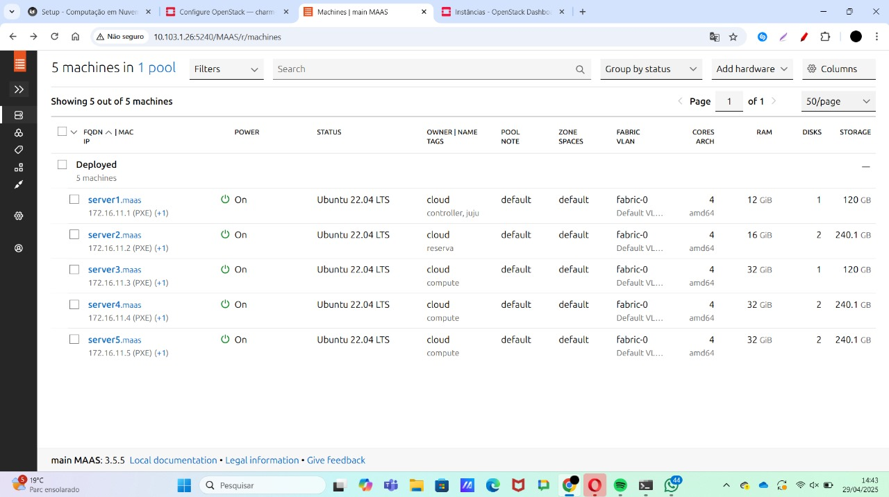
    *1 - Print do Dashboard do MAAS com as máquinas*

  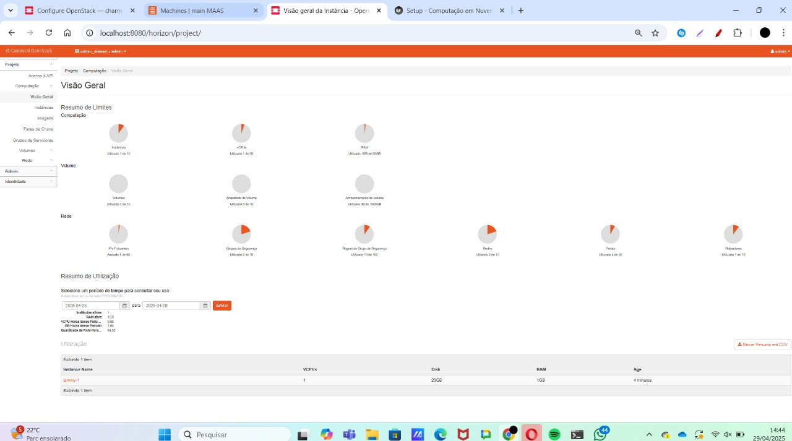
    *2 - Print da aba compute overview no OpenStack Dashboard*

  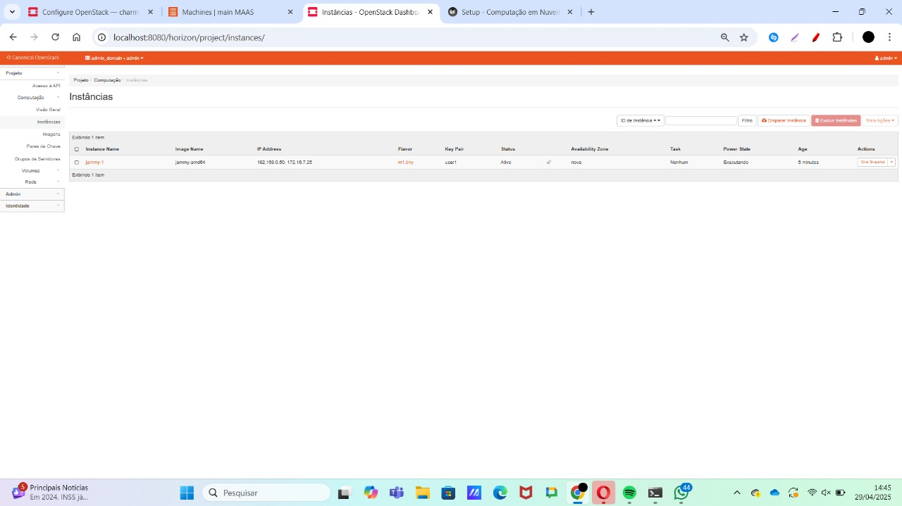
    *3 - Print da aba compute instances no OpenStack Dashboard*

  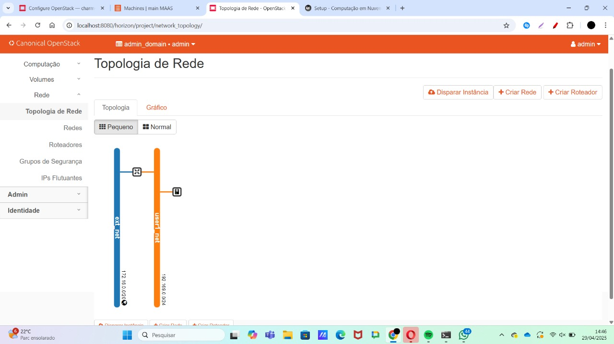
    *4 - Print da aba network topology no Openstack Dashboard*

  - As diferenças encontradas entre os prints da tarefa 1 e tarefa 2 são simplesmente o resultado da execução dos comandos de configuração do OpenStack. O dashboard do MAAS não mudou, já que tivemos problemas com o server3 e, portanto, adicionamos o nó reserva (node2) na parte de instalação antes da etapa de escalonamento de nós. A aba compute overview nos mostra uma visão geral, com todos os recursos adicionados no setup. Já a aba compute instances mostra a instância jammy1 criada. Por fim, a aba network topology mostra a rede interna e externa criadas, com o roteador e as subnets, todas criadas no setup.
  - Todos os recursos foram criados pela CLI do OpenStack, em que instalamos o openstackclient no começo da etapa.

  ### Escalando os nós
  - Como dito anteriormente, o server3 apresentou problemas, então realizamos esta etapa antes do setup com os seguintes comandos:
  ```
  juju add-unit nova-compute
  ```
  ```
  juju add-unit --to <id do node2> ceph-osd
  ```
 #### Tarefa 3
 ``` mermaid
graph TD
    A[Seu computador] -- 10.0.0.0/8 --> B[Roteador Insper]
    B -- 172.16.0.0/20 --> C[OpenStack Controller main]
    C -- Túnel SSH --> D[Load Balancer]
    D -- 192.169.0.28 --> E[API 1]
    D -- 192.169.0.54 --> F[API 2]
    E -- 192.169.0.85 --> G[Database]
    F -- 192.169.0.85 --> G[Database]
```

## App

### Uso da infraestrutura
 - Ultima etapa do roteiro foi integrar a API criada na primeira etapa do projeto da disciplina com a nuvem privada criada. 

 - Para isso, foi necessário levantar as aplicações em 4 instâncias do OpenStack:
    - 2 instâncias com a API do projeto, implementada em FastAPI - m1.tiny
    - 1 instância com o banco de dados, implementado em MySQL - m1.small
    - 1 instância com LoadBalancer, implementado em Nginx - m1.tiny

    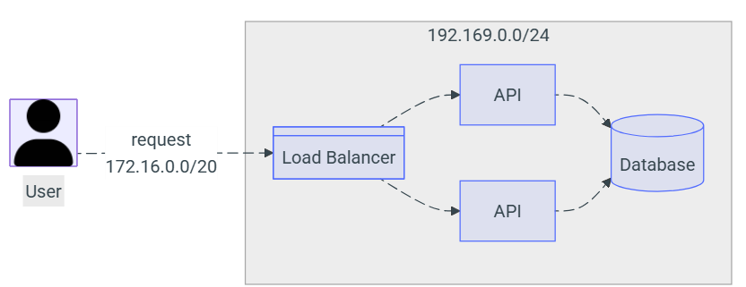
  
  - Para isso, utilizamos o mesmo procedimento da etapa anterior, criando as instâncias com os flavors m1.tiny e m1.small alocando os IPs flutuantes.
  ```
  openstack server create --flavor m1.tiny --image jammy-amd64 \
    --key-name user1 --network user1_net --security-group default \
    API_1
  ```
  ```
  openstack server create --flavor m1.tiny --image jammy-amd64 \
    --key-name user1 --network user1_net --security-group default \
    API_2
  ```
  ```
  openstack server create --flavor m1.small --image jammy-amd64 \
    --key-name user1 --network user1_net --security-group default \
    DATABASE
  ```
  ```
  openstack server create --flavor m1.tiny --image jammy-amd64 \
    --key-name user1 --network user1_net --security-group default \
    LOADBALANCER
  ```
  - Após isso, alocamos os IPs flutuantes para as instâncias.
  ```
  FLOATING_IP=$(openstack floating ip create -f value -c floating_ip_address ext_net)
  openstack server add floating ip API_1 $FLOATING_IP
  ```
  ```
  FLOATING_IP=$(openstack floating ip create -f value -c floating_ip_address ext_net)
  openstack server add floating ip API_2 $FLOATING_IP
  ```
  ```
  FLOATING_IP=$(openstack floating ip create -f value -c floating_ip_address ext_net)
  openstack server add floating ip DATABASE $FLOATING_IP
  ```
  ```
  FLOATING_IP=$(openstack floating ip create -f value -c floating_ip_address ext_net)
  openstack server add floating ip LOADBALANCER $FLOATING_IP
  ```
  - Com isso, conseguimos acessar as instâncias via SSH, usando o IP flutuante e fazer as instalações necessárias.

  - Para ambas instâncias da API, utilizamos o docker para baixarmos a imagem do nosso projeto. Já para a instância do banco de dados, também utilizamos o docker para baixarmos a imagem do MySQL. Por fim, na instância do LoadBalancer, instalamos o Nginx e configuramos o mesmo para fazer o balanceamento de carga entre as duas instâncias da API.

  - Tanto na instância do banco de dados quanto nas instâncias da API, criamos um arquivo .env, com as variáveis de ambiente ```nano .env```, com as credenciais de acesso ao banco de dados, determinados no projeto.

  - Com isso, para rodarmos as aplicações, utilizamos do comando ```docker run``` e tivemos que expor a porta 8080 com o comando ```-p 8080:8080```, e também o comando ```-env-file .env```, para que o docker conseguisse ler as variáveis de ambiente do arquivo .env.
  ```
  docker run -d -p 8080:8080 --env-file .env tanaka7/projetonuvem_ianvitor-api:latest
  ```

  - Por fim, fizemos um túnel SSH para o loadbalancer, com o comando ```ssh cloud@10.103.1.26 -L 8080:172.16.7.8:80```, para que conseguíssemos acessar a API via localhost:8080/docs.

#### Tarefa 4
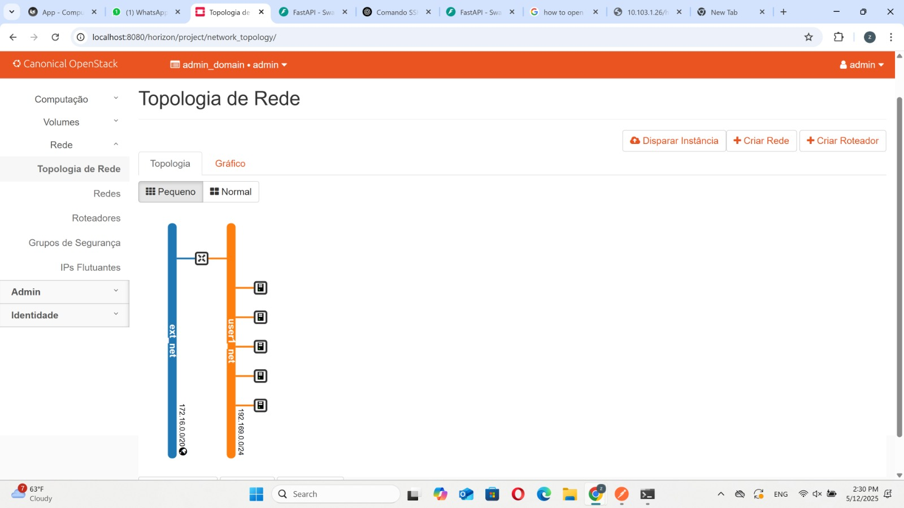
    *1 - Print da aba network topology*
  
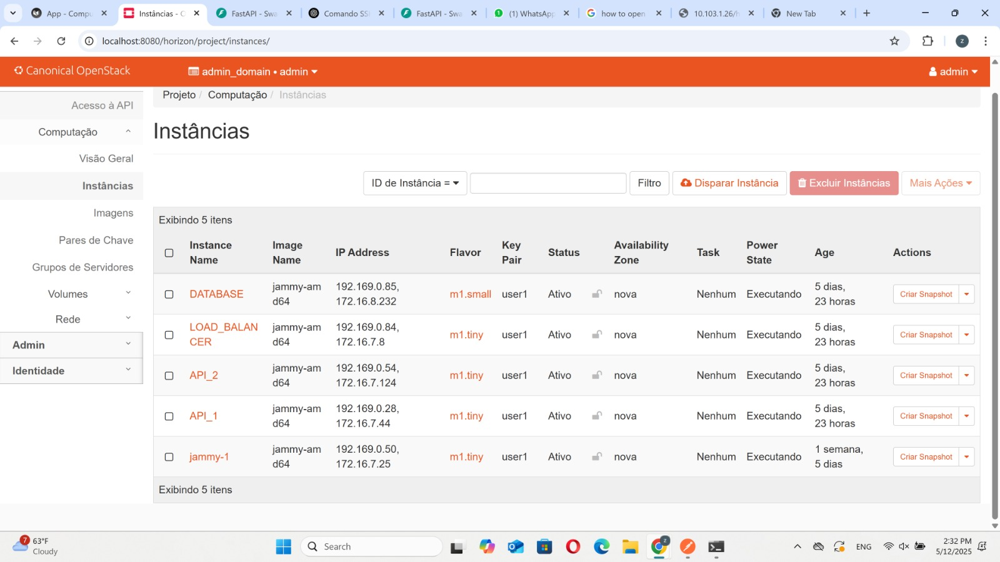
    *2 - Print das instâncias no OpenStack*

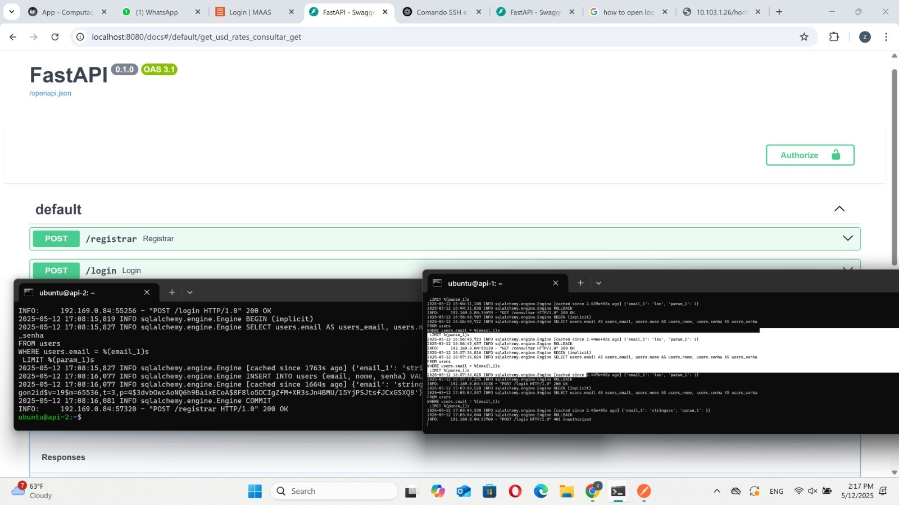
    *3 - Print do Dashboard do FastAPI conectado via máquina Nginx/LB*

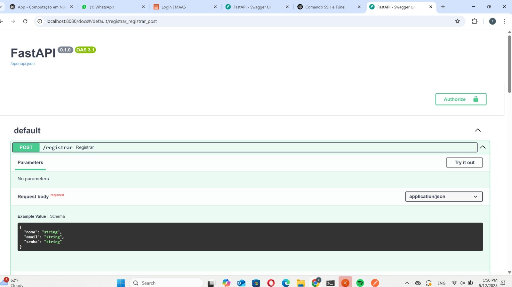
    *4 - Print do Dashboard do FastAPI conectado via máquina Nginx/LB *
  
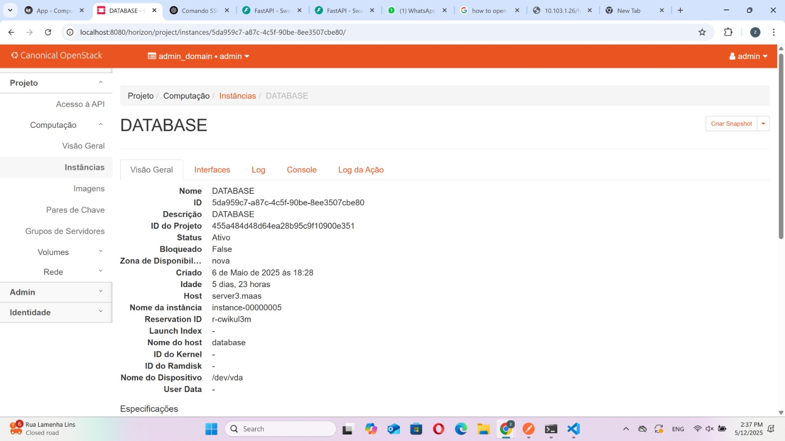
    *5 - Print da visão geral da instância DATABASE, mostrando em que server foi alocada*
 
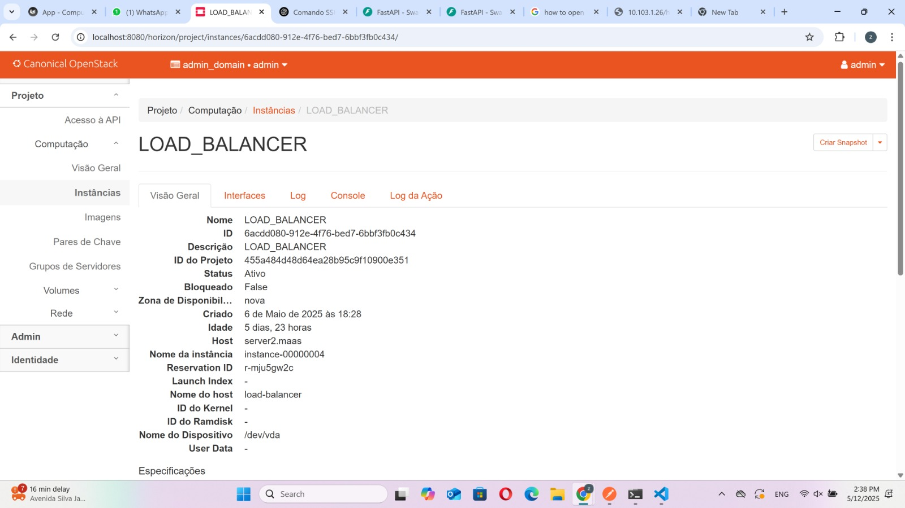
    *6 - Print da visão geral da instância LOADBALANCER, mostrando em que server foi alocada*

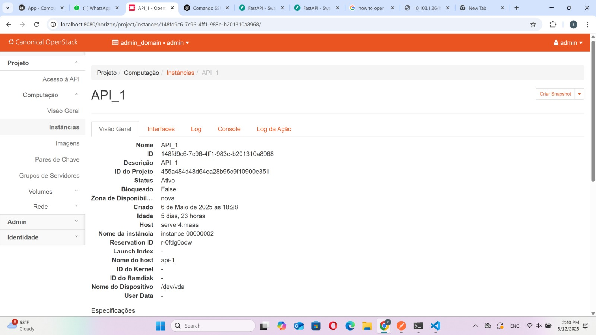
    *7 - Print da visão geral da instância API_1, mostrando em que server foi alocada*

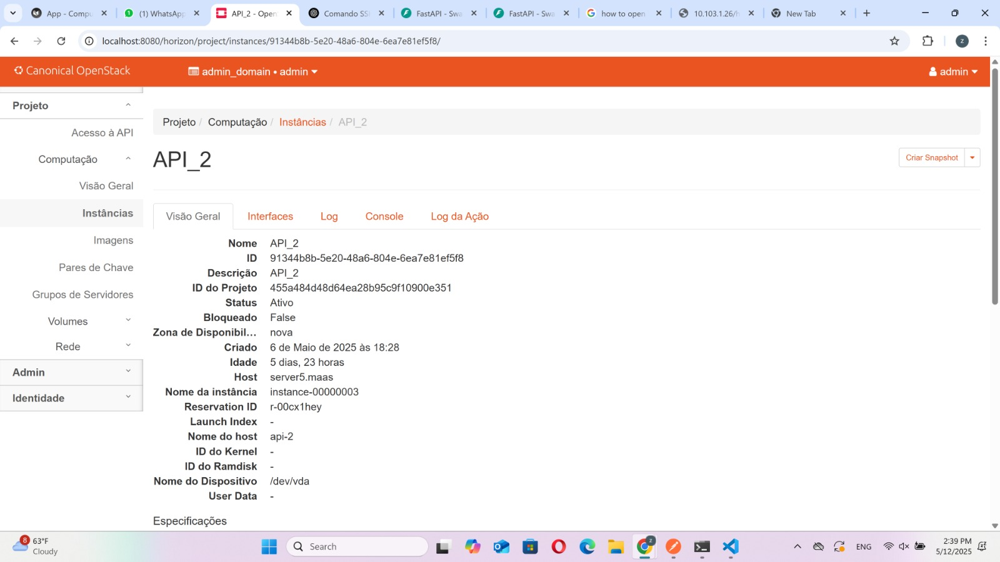
    *8 - Print da visão geral da instância API_2, mostrando em que server foi alocada*


## Discussões
Ao longo do roteiro, enfrentamos alguns desafios, principalmente que nosso server3 apresentava uma falha de hardware, em que possuia um disco a menos do necessário. Com isso, tivemos que adicionar o nó reserva (node2) na parte de instalação antes da etapa de escalonamento de nós, garantido a instalação de todos os serviços necessários corretamente na infra. Com isso, tiramos o aprendizado de que é importante verificar a saúde dos nós mais frequentemente para evitar problemas, mas também tivemos a oportunidade de improvisar e testar soluções alternativas para lidar com imprevistos. 

## Conclusão
Neste roteiro, conseguimos implementar uma nuvem privada com OpenStack e Juju, configurando os serviços necessários para o funcionamento da nuvem. Além disso, conseguimos integrar a API do projeto com a nuvem, utilizando o LoadBalancer para balancear a carga entre as instâncias da API. Com isso, conseguimos entender melhor como funciona a infraestrutura de uma nuvem privada e como podemos utilizar o OpenStack e o Juju para gerenciá-la. 