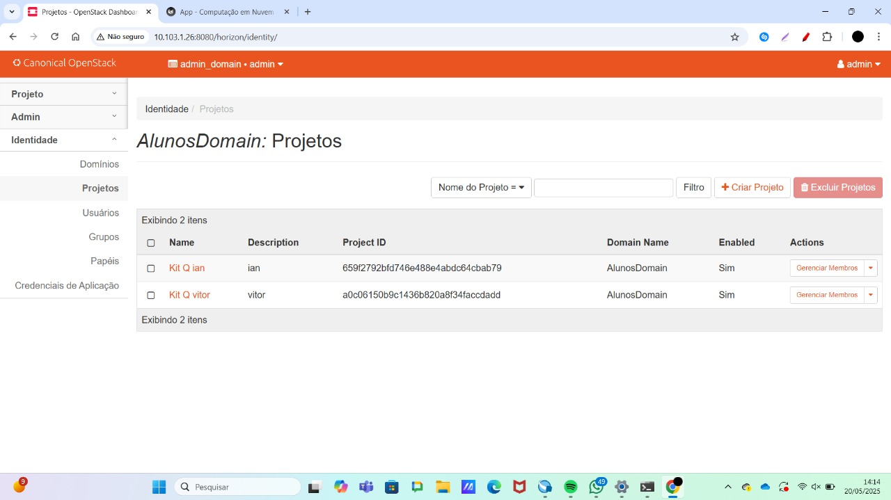
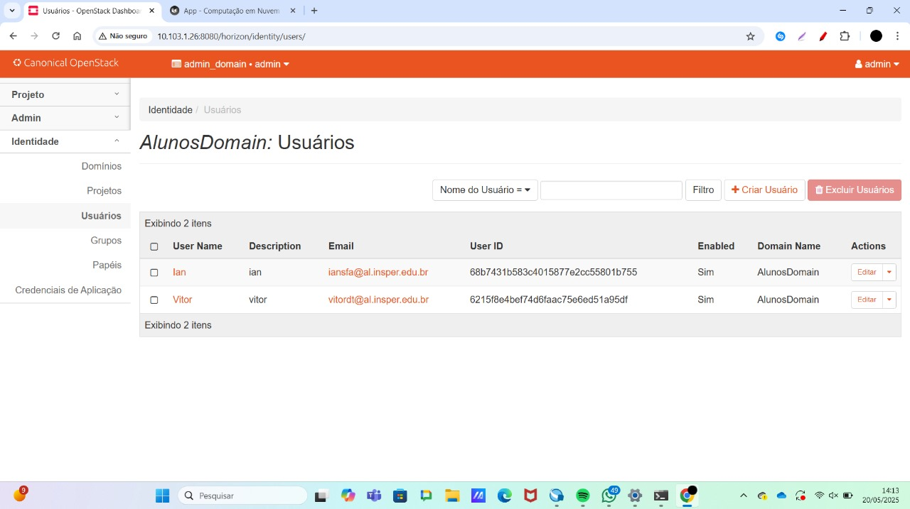
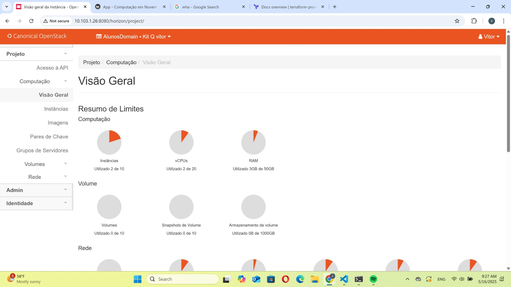
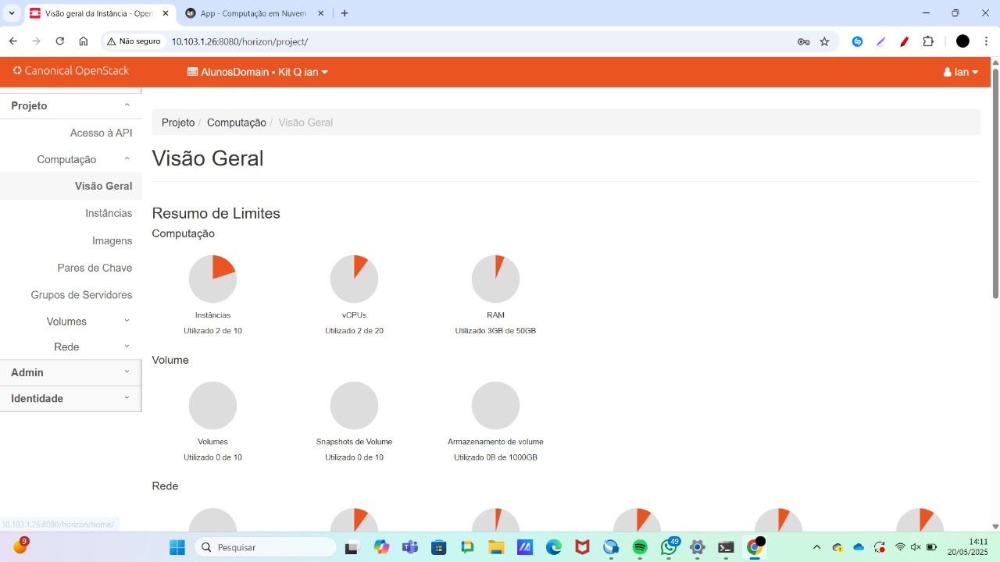
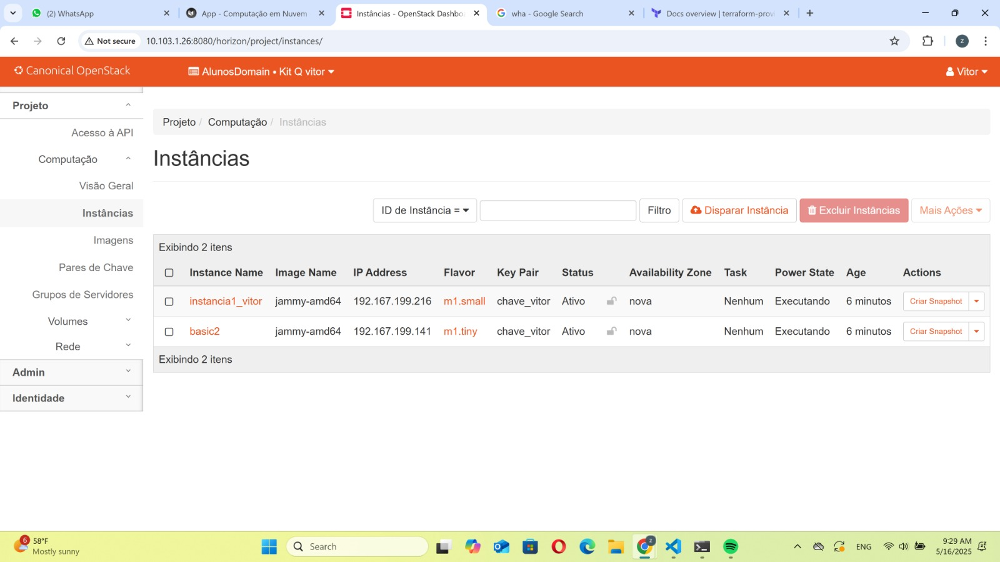
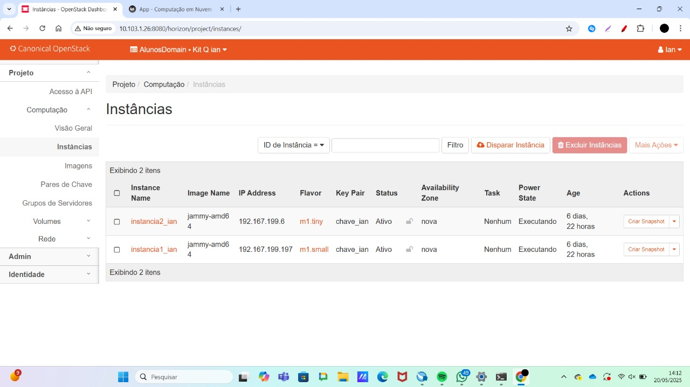
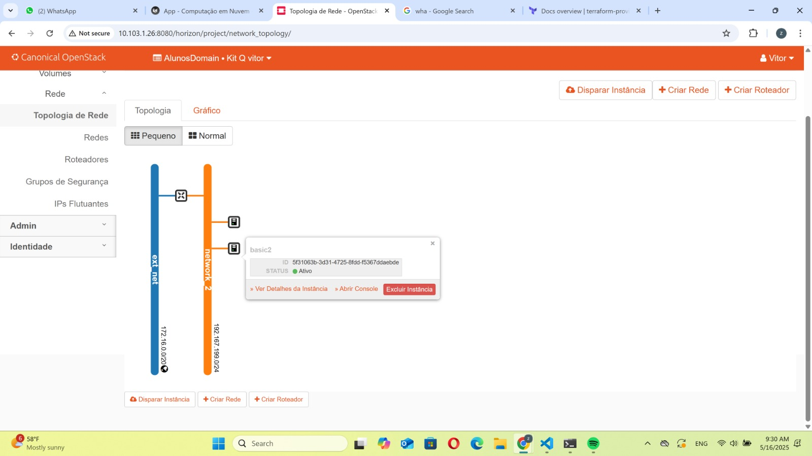
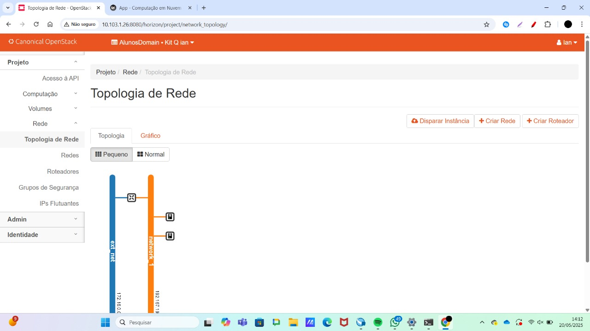

## __***Roteiro 4: SLA, DR e IaC***__

## Introdução

Este roteiro tem como objetivo utilizar a ferramenta de Infraestrutura como Código (IaC) ***Terraform*** para a criação de um projeto, suas respectivas configurações e infraestrutura dentro da plataforma ***OpenStack***. A proposta é automatizar o provisionamento de recursos de forma padronizada e reprodutível.

## Instalando o Terraform

O primeiro passo consiste na instalação do Terraform, utilizando os comandos listados abaixo:

```bash
wget -O- https://apt.releases.hashicorp.com/gpg | gpg --dearmor | sudo tee /usr/share/keyrings/hashicorp-archive-keyring.gpg
gpg --no-default-keyring --keyring /usr/share/keyrings/hashicorp-archive-keyring.gpg --fingerprint
echo "deb [signed-by=/usr/share/keyrings/hashicorp-archive-keyring.gpg] https://apt.releases.hashicorp.com $(lsb_release -cs) main" | sudo tee /etc/apt/sources.list.d/hashicorp.list
sudo apt update && sudo apt install terraform
```
## Infra
### Criando a hierarquia de projetos separado por aluno
O primeiro passo foi a criação de um domínio e dois projetos — um para cada integrante do grupo — e, em cada projeto, a criação de um usuário denominado "Aluno", utilizando o Horizon Dashboard do OpenStack.

## App
### Criando a Infraestrutura utilizando IaC

Cada integante entrou na maquina main de seu computador pessoal para criar a sua estrutura. criando uma pasta do projeto e  uma do terraform dentro dele nessa estrutura:
```plaintext
/meu-projeto/
└── terraform/
    ├── provider.tf
    ├── network.tf
    ├── router.tf
    ├── instance1.tf
    └── instance2.tf
```

- `provider.tf`: define o provedor e as credenciais do OpenStack.
- `network.tf`: cria a rede e a sub-rede.
- `router.tf`: configura o roteador e a interface de rede.
- `instance1.tf` e `instance2.tf`: criam as instâncias de máquina virtual.

### provider.tf

```hcl
terraform {
  required_version = ">= 0.14.0"
  required_providers {
    openstack = {
      source  = "terraform-provider-openstack/openstack"
      version = "~> 1.35.0"
    }
  }
}

provider "openstack" {
  region    = "RegionOne"
  user_name = "Ian"
  password  = "123"
  auth_url  = "https://172.16.0.31:5000/v3"
  insecure  = true
} 
```
### network.tf

```hcl
resource "openstack_networking_network_v2" "network_1" {
  name           = "network_1"
  admin_state_up = true
}

resource "openstack_networking_subnet_v2" "subnet_1" {
  network_id = openstack_networking_network_v2.network_1.id
  cidr       = "192.167.199.0/24"
}
```
### router.tf

```hcl
resource "openstack_networking_router_v2" "router_1" {
  name                = "my_router"
  admin_state_up      = true
  external_network_id = "ad2146a3-86bd-45bc-8bb7-3659c3af0fa9"
}

resource "openstack_networking_router_interface_v2" "int_1" {
  router_id = "${openstack_networking_router_v2.router_1.id}"
  subnet_id = "${openstack_networking_subnet_v2.subnet_1.id}"
}
```
### instance1.tf

```hcl
resource "openstack_compute_instance_v2" "instancia1_ian" {
  name            = "instancia1_ian"
  image_id      = "5e63750f-cbba-4ddb-986f-bab4971ada60"
  flavor_id     = "db628d07-5bf0-407c-9f1f-4f49cceca6b6"
  key_pair        = "chave_ian"
  security_groups = ["default"]


  network {
    name = "network_1"
}

}
```
Após isso, execute os seguintes comandos para criar o plano de execução do Terraform e, em seguida, aplicar esse plano:

```bash
terraform plan    
terraform apply   
```

## Exercicios
### Exercício 2

*Figura 1: aba Identy projects no OpenStack..*


---

### Exercício 3


*Figura 2: Identy users no OpenStack.*

---

### Exercício 4


*Figura 3: compute overview no OpenStack.*


*Figura 4:ompute overview no OpenStack.*

---

### Exercício 5


*Figura 5:compute instances no OpenStack*


*Figura 6:compute instances no OpenStack*

---

### Exercício 6


*Figura 7: network topology no OpenStack.*


*Figura 8:network topology no OpenStack.*


## Criando um Plano de Disaster Recovery e SLA

### Cenário: Você é o CTO de uma grande empresa com sede em várias capitais no Brasil e precisa implantar um sistema crítico, de baixo custo e com dados sigilosos para a área operacional.

**Resposta:**  
Optaríamos por implementar um sistema em cloud pública, pois inicialmente apresenta um custo mais baixo, já que não há necessidade de adquirir e manter servidores próprios. Além disso, provedores de cloud pública já oferecem garantias de segurança, escalabilidade e disponibilidade, atendendo aos requisitos de proteção dos dados sigilosos e operação eficiente.

---

### Explique para o RH por que você precisa de um time de DevOps.

**Resposta:**  
É fundamental contar com um time de DevOps, pois esses profissionais garantem a integração eficaz entre as áreas de desenvolvimento e operações. Em ambientes de computação em nuvem, a equipe de DevOps é responsável pela criação e manutenção da infraestrutura, além da gestão dos ambientes de desenvolvimento, utilizando ferramentas modernas como IaC (Infraestrutura como Código) para garantir ambientes escaláveis, seguros e padronizados.

Além disso, o time de DevOps atua na criação de pipelines de integração contínua, organização e gerenciamento de containers, integração eficiente de sistemas e monitoramento constante da infraestrutura, permitindo identificar e resolver falhas rapidamente, o que contribui diretamente para a agilidade e confiabilidade dos processos da empresa.


# Plano de Continuidade e Alta Disponibilidade (DR e HA)

## Mapeamento de Ameaças

### Ameaças Físicas

- **Falhas de hardware:** Defeitos em componentes físicos, como servidores ou discos rígidos, podem causar **interrupções no serviço**, perda de dados e comprometimento da integridade do sistema.

- **Desastres naturais:** Eventos como **inundações, incêndios, terremotos, tsunamis ou erupções vulcânicas** podem danificar fisicamente os datacenters e equipamentos de rede e servidores, gerando **indisponibilidade total da infraestrutura**, perda de dados e falhas no fornecimento de energia.

- **Acesso físico não autorizado:** Invasões ou acesso indevido aos servidores podem resultar em **danos físicos, destruição de equipamentos e roubo de dados confidenciais**, além de abrir brechas para **ataques futuros**.

### Ameaças Lógicas

- **Ataques cibernéticos:** Ações como **DDoS, injeções de SQL, phishing** e malwares representam riscos severos à **disponibilidade, integridade e confidencialidade** do sistema e dos dados armazenados.

---

## Ações Prioritárias para Recuperação em Caso de Desastres

- **Backups de dados:**  
  Realização de **backups regulares e automáticos**, armazenados em **locais seguros, criptografados e geograficamente distantes (mínimo de 100 km)** do datacenter principal, garantindo proteção contra desastres físicos de grande escala.

- **Balanceamento de carga (Load Balancer):**  
  Implementação de **balanceadores de carga** para distribuir o tráfego de forma inteligente entre múltiplos servidores, prevenindo sobrecarga e mantendo o funcionamento dos serviços mesmo em caso de falha de um dos nós.

- **Monitoramento contínuo:**  
  Implantação de **ferramentas de monitoramento proativo** (físico e virtual) que detectem falhas, anomalias de desempenho e possíveis ataques, possibilitando uma **resposta rápida e eficiente** antes que o problema se agrave.

- **Escalonamento à disposição:**  
  Manter um plano de escalonamento e máquinas reservas prontas para serem ativadas conforme a demanda. Dessa forma, é possível aumentar rapidamente a capacidade da aplicação ou substituir nós em caso de falha, garantindo a continuidade dos serviços sem interrupções.

## Política de Backup
Iriamos realizar backups diarios em horarios predeterminados, em localizações geograficamente com uma distancia minima de 100km dos servidores atuais


## Estratégia de Alta Disponibilidade (HA)

- **Redundância geográfica:**  
  Serviços distribuídos em **múltiplas zonas de disponibilidade**, com replicação ativa/ativa ou ativa/passiva de componentes críticos.
- **Load Balancer:**  
  Utilização de **balanceadores de carga** para distribuir o tráfego entre diferentes servidores, garantindo que a aplicação suporte um volume maior de acessos e seja facilmente escalonável, além de aumentar a disponibilidade e tolerância a falhas.
- **Queues:**  
  Caso a demanda ultrapasse a capacidade de processamento, o sistema deve ser capaz de colocar as requisições em uma fila, garantindo que todas sejam atendidas assim que houver recursos disponíveis. Isso evita sobrecargas, mantém a estabilidade do sistema e assegura o atendimento de todas as solicitações mesmo durante picos de acesso.
